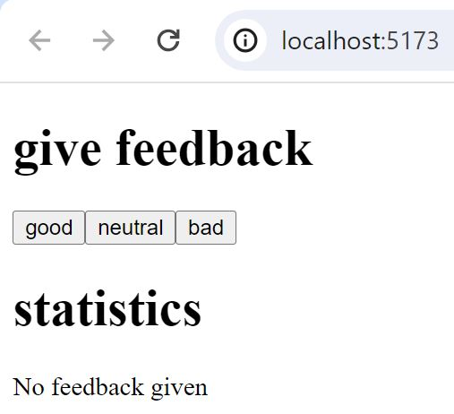
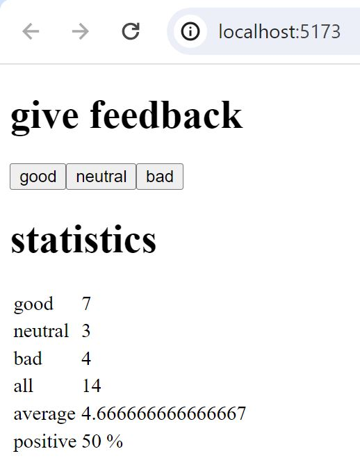

# Unicafe

A basic react web application for collecting customer feedback for the student restaurant of the University of Helsinki, [Unicafe](https://unicafe.fi/).

## App default state:

## App after user clicks on buttons:

