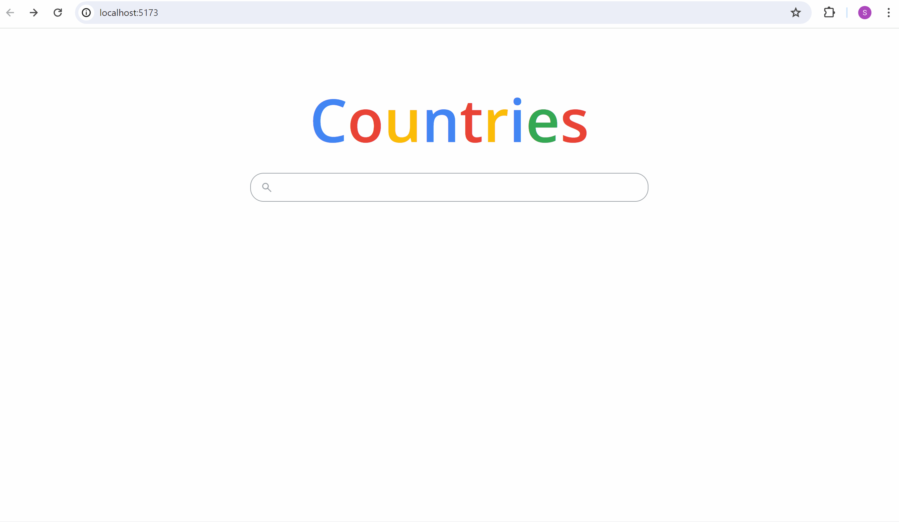
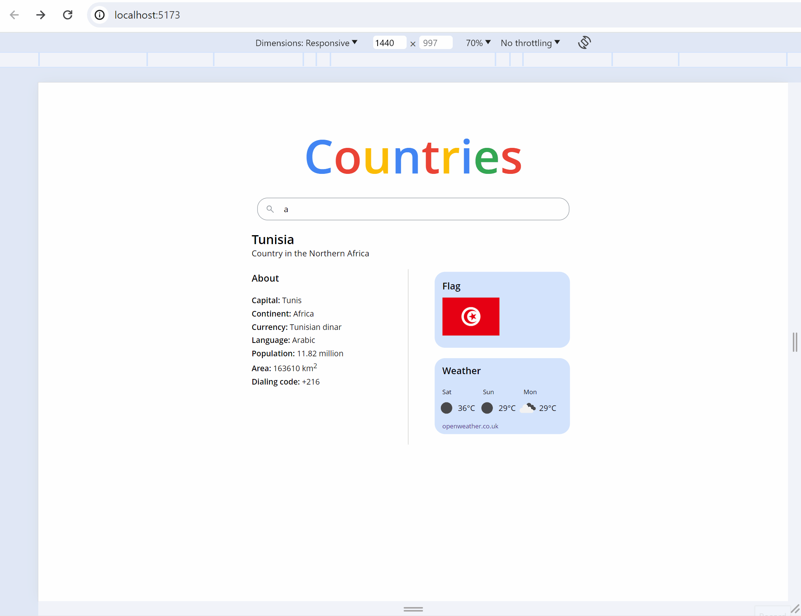

# Countries

A basic react web phonebook application to search and view details of a country, which can be tested [here](https://countries-c2ak.onrender.com/). The app is styled with plain CSS, with CSS Modules to scope to each React component.

## APIs

- The University of Helsinki's [RESTful API](https://studies.cs.helsinki.fi/restcountries/) provides a list of countries with information on their capital city, population, currency, etc. The images of the countries' flags are also obtained from the API.
- [OpenWeather's API](https://openweathermap.org/api) provides real-time weather data and forecasts for the next 5 days in 3 hour intervals under the free tier. The project utilises the forecast data to display the weather for the next 3 days.

## App Features

## Search for a List of Countries

A list of up to 10 countries will be displayed after the user keys in an input. To view a particular country's information, the user can either:

- Click on the country in the list
- Use arrow keys to navigate through the list and press enter at the selected country

## View a Country's Details and Weather Information

Basic information of the country, such as capital and currency, along with the weather forecast for the next 3 days (24 hour intervals from the closest forecast timing to the present time) are displayed.

## Mobile Responsiveness

The app layout changes according to the screen sizes as seen below.

## Running locally

1. Change `const SERVER_URL = "/api/proxy";` to `const SERVER_URL = "http://localhost:3001/api/proxy"` in `App.jsx`.

2. Open 2 terminal windows and run `npm run dev` at the `countries` and `countries-backend` directories respectively.

3. Open Chrome and enter the url `http://localhost:3001` to interact with the app.
