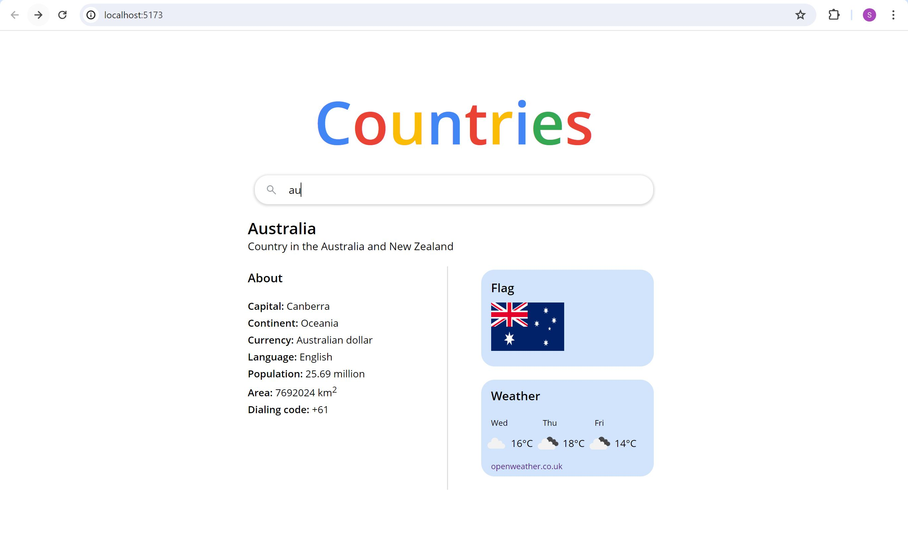

# Countries

A basic react web phonebook application to search and view details of a country, which can be tested [here](https://countries-c2ak.onrender.com/).

## Search for a List of Countries
List of countries are retrieved from the University of Helsinki's [RESTful API](https://studies.cs.helsinki.fi/restcountries/).


## Search for a Country's Details and Weather Information

Weather information for the country's capital is retrieved from [OpenWeather's API](https://openweathermap.org/api). This section on the country's details can be accessed in 2 cases:

- there is only one country matching the filter input
- user clicks on show button from the list of countries
  

## Running locally

1. Change ```const SERVER_URL = "/api/proxy";``` to ```const SERVER_URL = "http://localhost:3001/api/proxy"``` in ```App.jsx```.

2. Open 2 terminal windows and run ```npm run dev``` at the ```countries``` and ```countries-backend``` directories respectively.

3. Open Chrome and enter the url ```http://localhost:3001``` to interact with the app.
