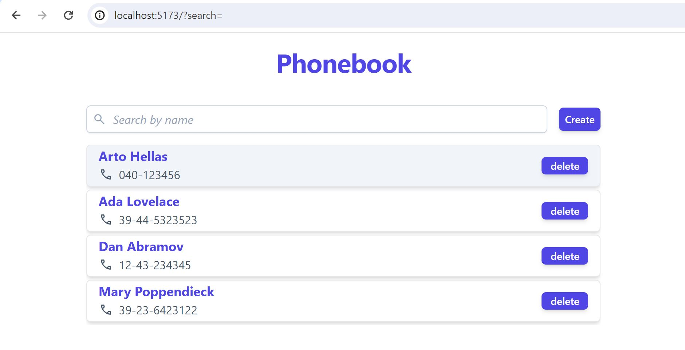
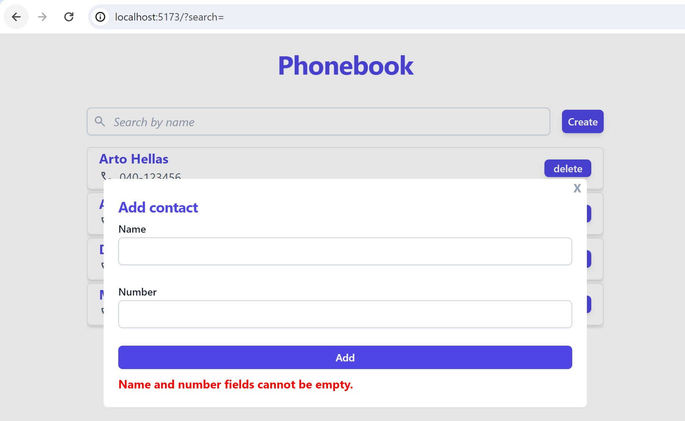

# Phonebook

A basic react web phonebook application to create, read, update and delete (CRUD) persons from a json-server. The server is replaced with a backend server built with Express.js in [Part 3](https://github.com/spzj/full-stack-open/tree/main/Part%203%20-%20Programming%20a%20server%20with%20NodeJS%20and%20Express/phonebook-backend).

## Test Application
Clone the repository into your local directory and open two instances of the command prompt. Ensure that you have installed Node.js and run `npm install` to install the necessary packages. Run `npm run server` on one window before running `npm run dev` on the other window. The application can be tested with a browser (e.g. Chrome) locally at an address similar to http://localhost:5173/.

## Filter Persons

Persons in the phonebook can be filtered by name in a case-insensitive manner.

## Non-persistent Notifications for New Person Submissions

**Errors:**

- Empty name field
- Empty number field
- Both name and number field empty
- Number exists in phonebook
- Number contains characters other than digits [0-9], dash [-], plus [+] and parentheses [()]

**Success:**

- Add new person
- Name exists in phonebook -> Update number for existing person
- Delete persons

