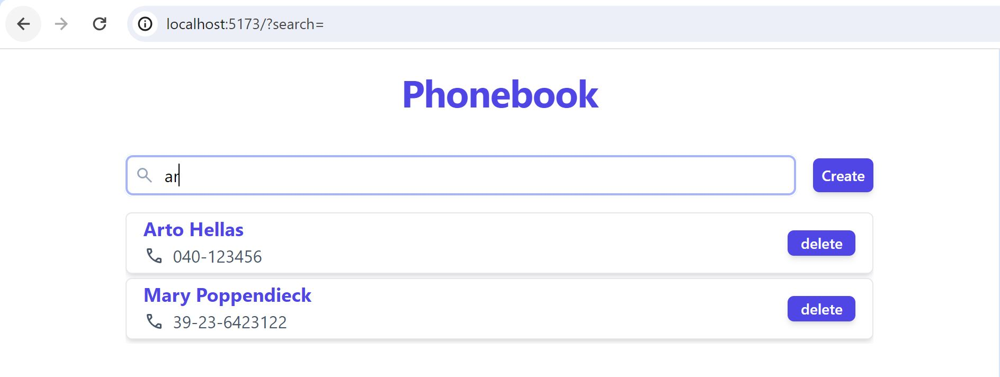

# Phonebook

A basic react web application to add and search for persons in a phonebook.

## Filter Persons
Persons in the phonebook can be filtered by name in a case-insensitive manner.

## Form Validation for New Person Submissions
Pop-up alerts in the following cases:
- Empty name field
- Empty number field
- Both name and number field empty
- Name exists in phonebook
- Number exists in phonebook
- Number contains characters other than digits [0-9], dash [-], plus [+] and parentheses [()]
