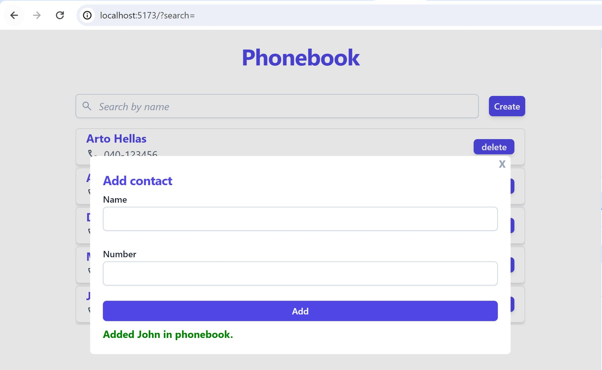

# Phonebook

A basic react web phonebook application to add, filter, update, delete persons from an Express.js server. The app is deployed on render, and can be tested [here](https://phonebook-backend-1rqy.onrender.com/).

# Frontend

## Filter Persons

Persons in the phonebook can be filtered by name in a case-insensitive manner.

## Non-persistent Notifications for New Person Submissions

**Errors:**

- Empty name field
- Empty number field
- Both name and number field empty
- Number exists in phonebook
- Number contains characters other than digits [0-9], dash [-], plus [+] and parentheses [()]

**Success:**

- Add new person
- Name exists in phonebook -> Update number for existing person
- Delete persons

# Backend

The backend server is built with Express.js.

## Information

## Resources

Single resource can be located by id.

