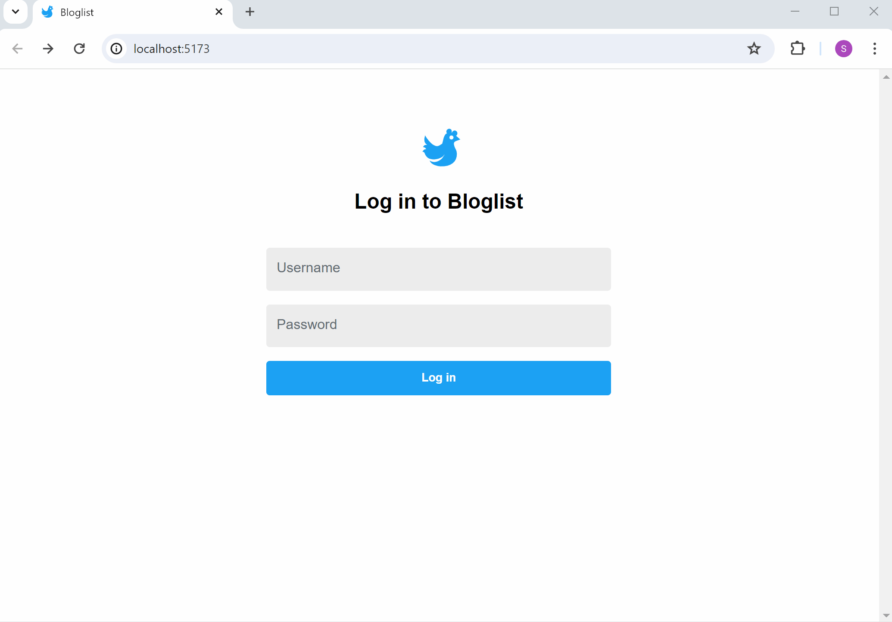
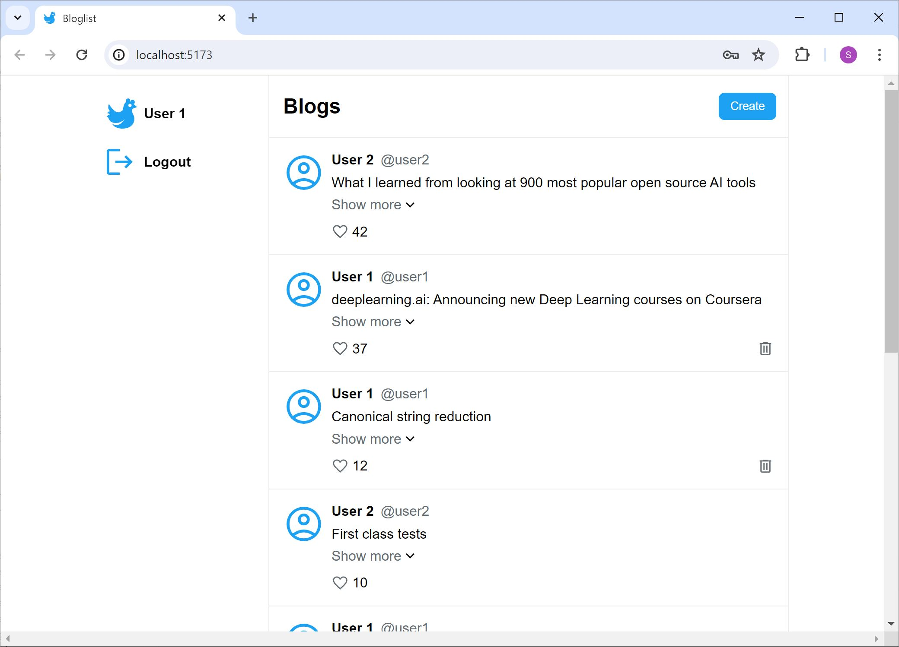
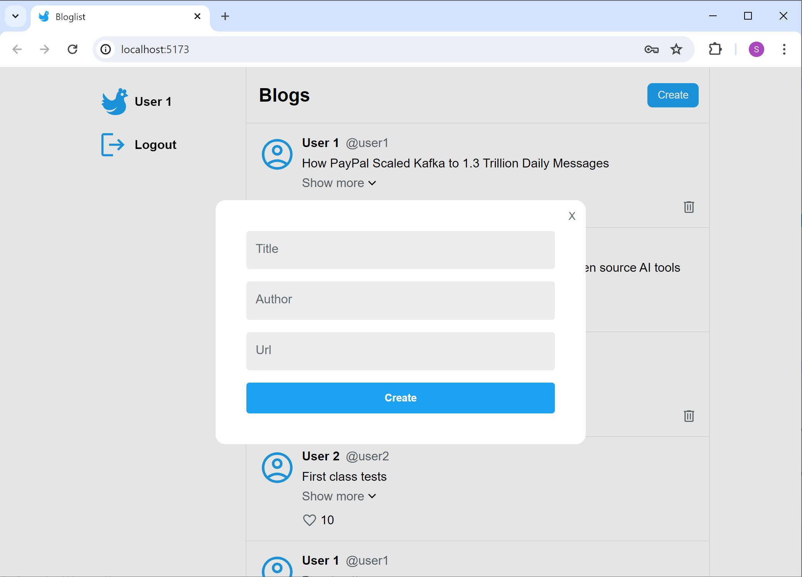
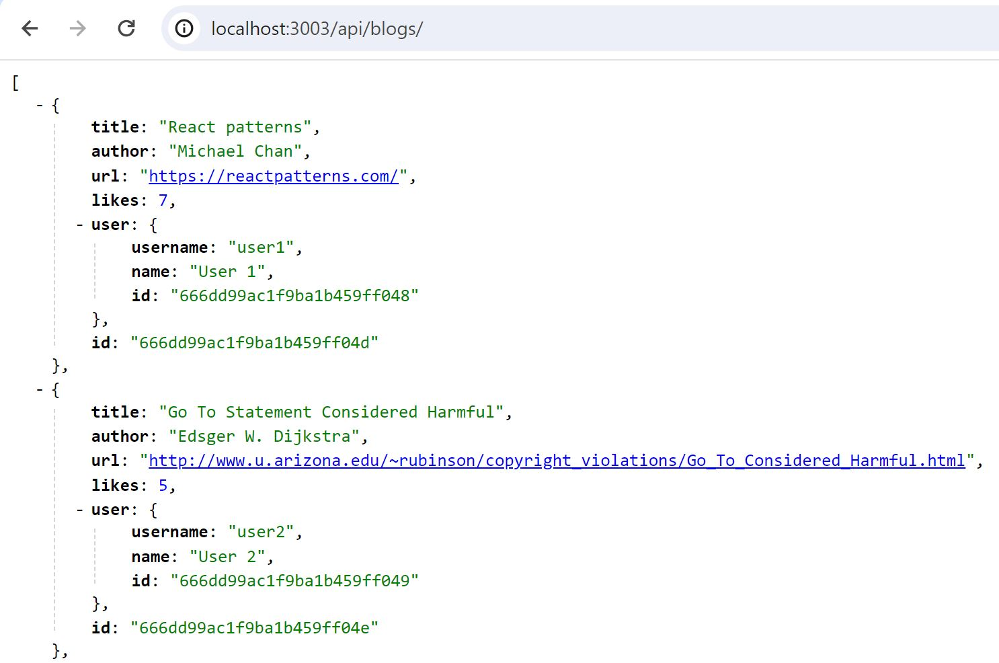
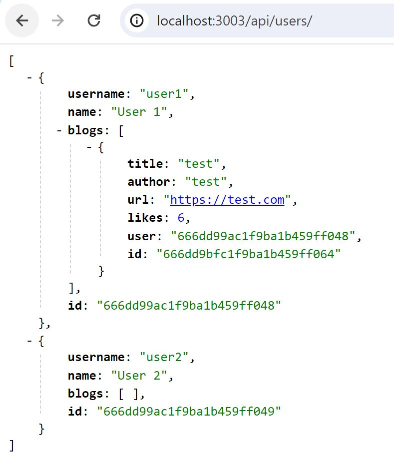

# Bloglist

A full stack MERN web application with token-based authentication (expires in an hour) for users to view, like, create and delete blogs.

## Frontend

### Login

### Blog Feed

### Create Blog Modal

### Mobile Responsiveness

## Backend

GET, DELETE, POST, PUT route methods for both APIs.

### Blogs API

### Users API

