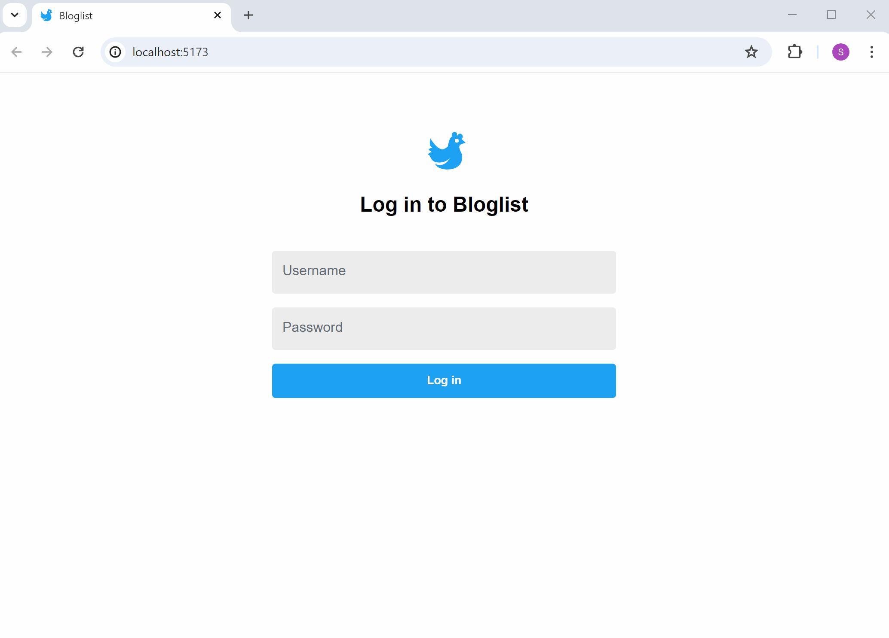
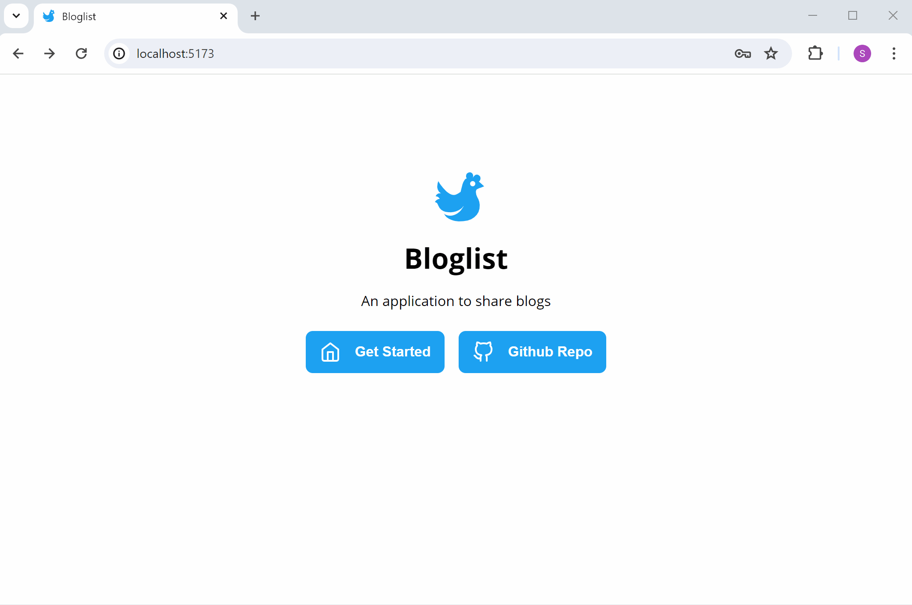
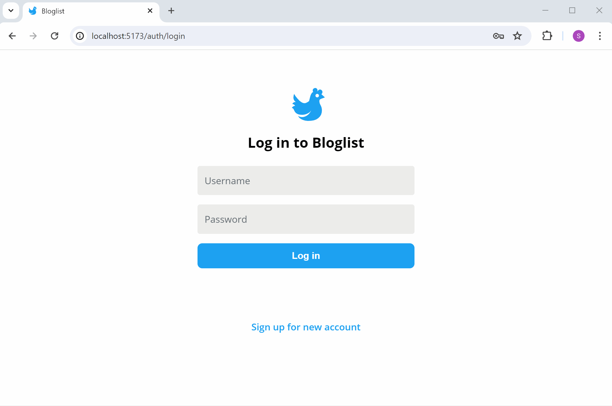
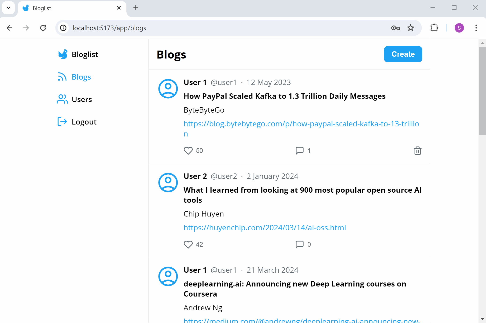
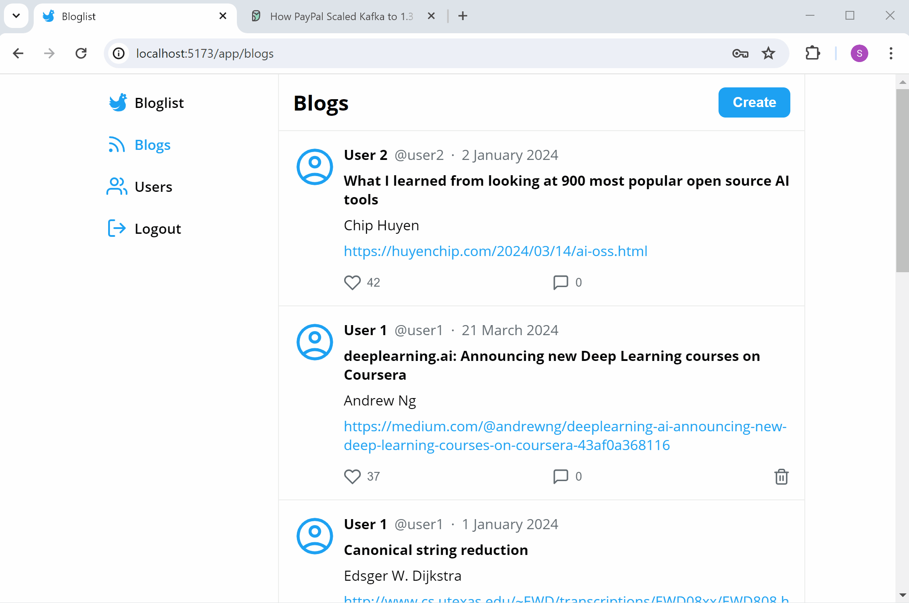
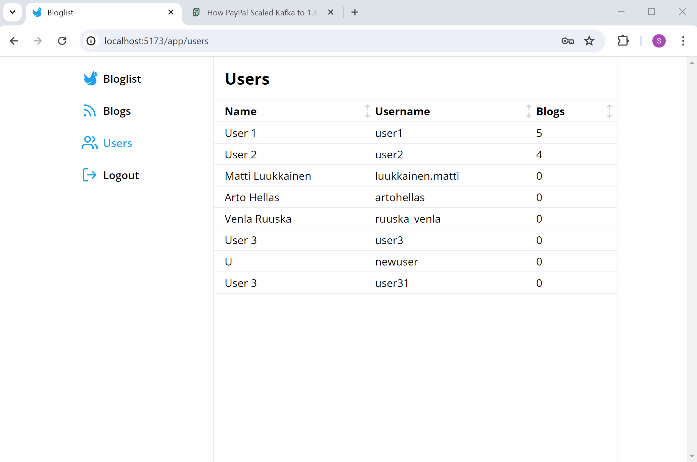
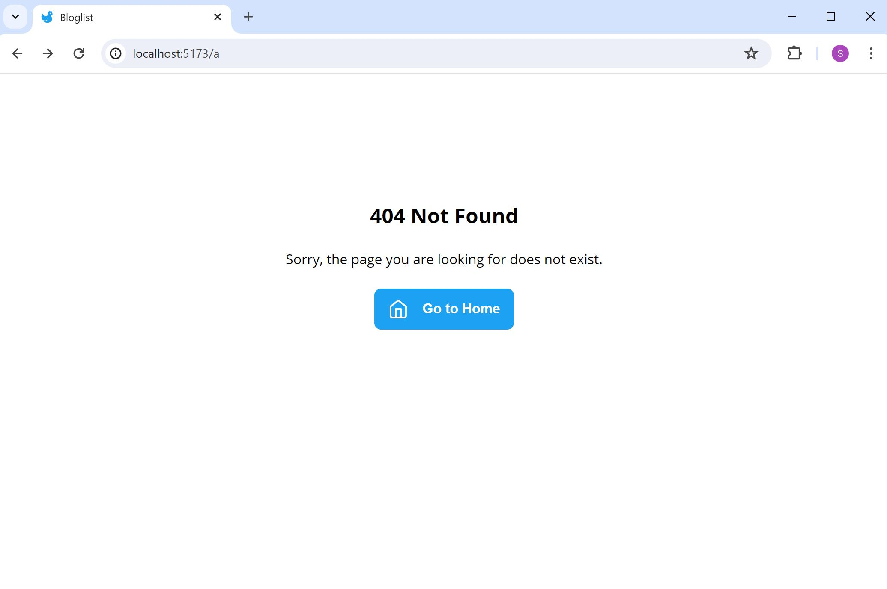
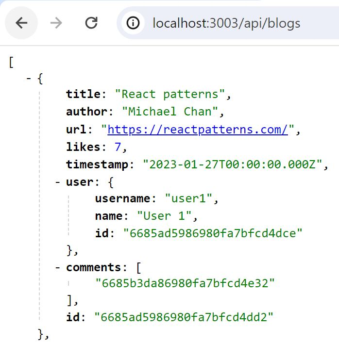
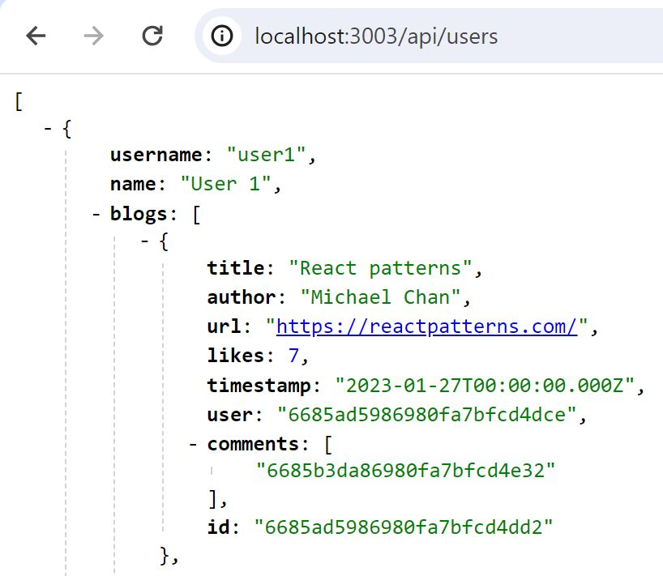

# Bloglist

A full stack MERN web application with token-based authentication (expires in an hour) for users to view, like, comment, create and delete blogs. React query and Context are used for the state management of the application, and React Router is used for setting up the routes.

## Frontend

### Landing Route

This route can be accessed from the navigation bar when the user is logged in. The `Get Started` button redirects to the login page if the user is not logged in, and to the app route when the user is already logged in. The `Github Repo` button launches a new tab that navigates to this current repository.

### Authentication Route

Users can register for an account that fulfills the following requirements:

- Username is unique and has a minimum length of 3
- Password with a minimum length of 3

### Blogs Route

Blogs are ordered by the number of likes, in the descending order. Each blog has various points of interaction:

- Clicking on the user's profile icon, username, or name leads to their respective profiles
- Clicking on the url redirects to an external website
- Clicking on the like or delete buttons to like or delete the blog
- Clicking anywhere else within the div redirects to the individual blog view
- Clicking and dragging within the div (e.g. to copy the text) will not trigger any actions

Users can create new blogs by clicking the `Create` button, which launches a modal with a form.

### Users Route

Users are displayed in a table that is sortable by name, username and number of blogs posted. A user's profile can be viewed by clicking on its corresponding row.

### Error Route

This route will be displayed when the user enters an invalid route.

### Mobile Responsiveness

## Backend

GET, DELETE, POST, PUT route methods for both APIs.

### Blogs API

### Users API

The array of blogs posted by the user are not stored in the user schema, but is virtually populated during a GET api call to adhere to the principal of least cardinality.

